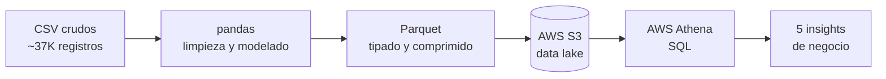

# Seguros Monarca - Data Pipeline

Pipeline de datos de punta a punta para una aseguradora ficticia:
ingesta de datos crudos -> limpieza -> modelado -> data lake (s3) -> consultas (Athena) -> dashboard

## Problema
El cliente (gerente de datos de Seguros Monarca) busca limpiar distinta informacion que tiene regada por diferentes sistemas los cuales cada uno exporta de diferente manera. 

## Objetivo de negocio
Nos solicita llegar a una conclusion y visualizacion leve de los datos. Asi mismo, se busca resolver 5 incognitas:
1. Ingreso de primas por producto y mes
2. Siniestralidad (siniestros ÷ primas) por producto
3. Concentracion de polizas y siniestros por estado
4. Polizas activas vs vencidas/canceladas e ingreso en riesgo
5. Monto promedio de siniestro por categoria

## Arquitectura
 


## Stack
Python | pandas | SQL | AWS S3 | AWS Athena | Git


## Calidad de datos: problemas detectados y resueltos
Existian diferentes tipos de categorias: 16 variantes de "producto", ademas de estatus y metodos mezclando variantes en ingles y español. Se realizo una estandarizacion con `.str` y mapeo, a 4 productos, 3 estatus de poliza, 5 estatus de siniestro y 4 metodos.

Fechas en 3 formatos diferentes `dd/mm/yyyy`, `yyyy-mm-dd` y `mm-dd-yyyy` se realizo un parseo multi-formato el cual nos evito un bug el cual corrompia aprox. 1900 datos.

Se encontraron 147 primas invalidas las cuales contaban con signo negativo. Se corrigio con valor absoluto, se llego a la conclusion que los valores no era necesario descartarlos y se podian recuperar.

Se hallaron bastantes datos nulos entre diversas columnas de varias tablas. Se corrigio rellenando las tablas con etiqueta de "Desconocido". En el caso de valores como el monto se preservaron vacios para evitar distorciones en los calculos.

Asi mismo, se borrar los valores duplicados los cuales eran como 40 datos en una columna.

Y finalmente se limpio el texto sucio en algunas columnas (espacios sobrantes o casing inconsistente).


## Preguntas de negocio (resultados)
Las 5 consultas SQL están en la carpeta `sql/`. Hallazgos destacados:
 
- **Ingresos:** *Auto* es el producto con mayor ingreso (Aprox. $65.6M MXN en primas).
- **Retención:** Aprox. $94M MXN en primas estan en polizas *vencidas o canceladas*.
- **Siniestralidad:** No varian mucho de entre los productos, pero el de mayor siniestralidad y tener mas presente es *Gastos Medicos*.
- **Análisis regional:** Estados donde hubo mayor concentracion de polizas y siniestros fueron *CDMX, Baja California y Coahuila*.


## Como reproducirlo
 
```bash
# 1. Clonar y entrar
git clone https://github.com/Alexcgzz/seguros-monarca-data-pipeline.git
cd seguros-monarca-data-pipeline
 
# 2. Entorno virtual + dependencias
python -m venv .venv
.venv\Scripts\activate            # Windows (en Mac/Linux: source .venv/bin/activate)
pip install pandas jupyter faker pyarrow
 
# 3. Generar los datos crudos
python generar_datos.py
 
# 4. Ejecutar los notebooks en orden (01 → 02) para perfilar, limpiar y exportar a Parquet
# 5. Subir data/processed/*.parquet a un bucket de S3 y consultar con Athena (ver carpeta sql/)
```


## Notas y limitaciones
 
- Los datos son **sintéticos** (generados con `Faker`), diseñados con imperfecciones realistas para practicar el pipeline de limpieza. No representan datos reales de ninguna aseguradora.